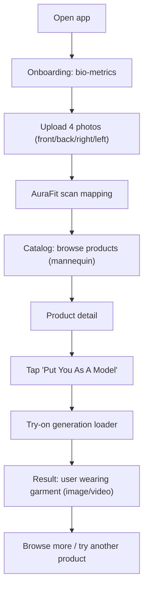

## 1. Product Overview
AuraFit AI is a premium fashion try-on experience that turns shoppers into the model using their own body inputs and photos.
It reduces fit uncertainty and increases conversion by visualizing how premium garments look on the user in a signature “AuraFit” scanning aesthetic (matte black + emerald neon).

- Target users: fashion shoppers buying premium apparel online, style-forward customers, users who care about fit and silhouette
- Value: higher confidence in purchases, fewer returns, more engagement via personalized visuals

## 2. Core Features

### 2.1 User Roles (if applicable)
| Role | Registration Method | Core Permissions |
|------|---------------------|------------------|
| Guest | No login | Complete onboarding locally, browse catalog, run try-on in the current session |
| Signed-in User | Supabase Auth (email OTP) | Sync profile and results across devices, access history of generated try-ons |

### 2.2 Feature Module
1. **Onboarding (Body Mapping)**: bio-metrics form, 4-photo upload, scan-style processing
2. **Catalog (Discovery)**: premium products displayed on a standard mannequin, filters/search (lightweight)
3. **Product Detail + Try-On**: product gallery, sizing info, CTA “Put You As A Model”, AI result viewer (image/video)

### 2.3 Page Details
| Page Name | Module Name | Feature description |
|-----------|-------------|---------------------|
| Onboarding | Bio-metrics form | Inputs: height, age, weight; optional waist circumference. Inline validation, unit hints, save to Supabase when signed-in (local fallback for guest). |
| Onboarding | Photo upload | Require 4 photos: front, back, right, left. Drag/drop + camera upload support, preview grid, basic quality checks (min resolution, face visible warning). Store in Supabase Storage when signed-in (local blob URLs for guest). |
| Onboarding | Body scan experience | Fullscreen transition: matte black surface + emerald scanning lines, “mapping topography” copy, progress indicator, ability to cancel and retry. |
| Catalog | Product grid | Premium editorial cards with mannequin preview, quick view, price, tags (new, limited, best fit). |
| Catalog | Discovery tools | Search, category chips, sort (newest / price / popularity). |
| Product Detail | Product storytelling | Name, price, materials, care, fit notes, size chart, mannequin gallery. |
| Product Detail | Magic CTA | Neon emerald button: “Put You As A Model”. Disabled until onboarding complete. |
| Product Detail | Try-on loading | Contextual loader echoing scan effect, shows stages: “Aligning posture”, “Mapping drape”, “Synthesizing lighting”. |
| Product Detail | AI output viewer | Swaps mannequin media to user try-on result. Supports image first; optional short looping video. Before/after toggle. Download/share (optional). |

## 3. Core Process
Primary user flow:
1. User opens app and completes onboarding: bio-metrics + 4 photos.
2. App shows AuraFit scan mapping sequence and saves profile + photos (Supabase for signed-in users, local fallback for guests).
3. User browses catalog (mannequin default).
4. User opens a product (e.g., “Urban Stealth Casual Jacket”) and clicks “Put You As A Model”.
5. App generates a personalized try-on output and replaces mannequin media with the user wearing the garment.

## 4. User Interface Design
### 4.1 Design Style
- Primary colors: matte black (#070A0A) backgrounds, deep charcoal panels, emerald neon accents (#00FF9A to #00D47A)
- Secondary accents: subtle metallic gray highlights, occasional “aura” gradient glows (emerald → cyan)
- Buttons: sharp, premium shapes with a neon edge glow; primary CTA is a high-contrast emerald “beam” button
- Typography: editorial display font for headings + refined sans/mono for UI metrics (avoid generic defaults)
- Layout: desktop-first, gallery-forward product detail, immersive fullscreen transitions for scan/generation
- Icon style: minimal line icons with emerald hover states; no playful emoji in core UI

### 4.2 Page Design Overview
| Page Name | Module Name | UI Elements |
|-----------|-------------|-------------|
| Onboarding | Form + upload | Split layout: left form, right photo grid; emerald focus rings; validation as subtle inline text; “Start Mapping” CTA. |
| Onboarding | Scan sequence | Fullscreen matte black, animated emerald scan lines, grain/noise overlay, staged progress labels, smooth fade to Catalog. |
| Catalog | Discovery grid | Editorial product cards, mannequin centered, hover reveals fabric detail + quick CTA, sticky discovery bar. |
| Product Detail | Mannequin gallery | Large media viewer, thumbnail strip, fit highlights, size chart modal. |
| Product Detail | Try-on CTA + output | CTA under mannequin media; on result, swap media + “Before/After” toggle + optional download/share. |

### 4.3 Responsiveness
Desktop-first with mobile-adaptive layout:
- Onboarding becomes stacked (form above photo grid)
- Catalog uses 2-column grid on mobile, simplified filters
- Product detail uses single-column media-first layout, sticky CTA near bottom
