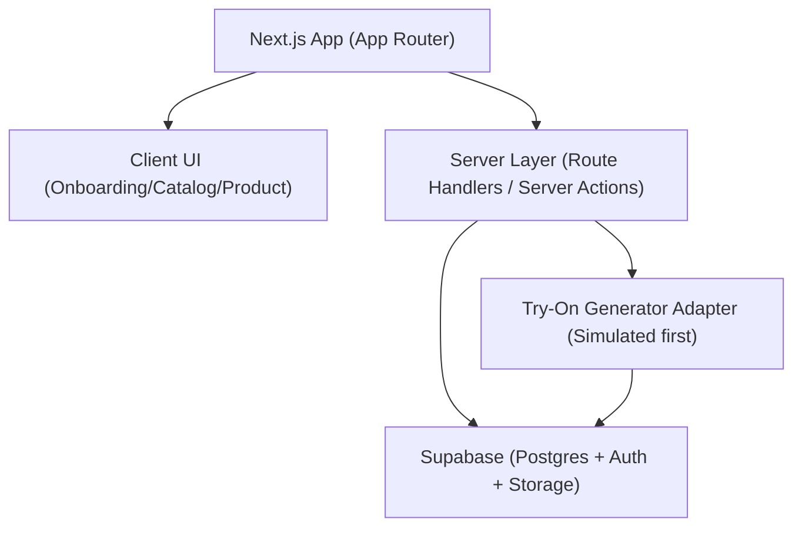
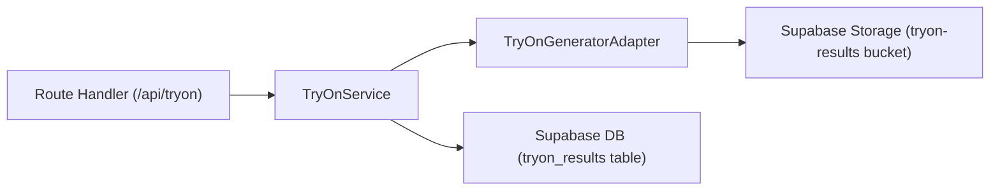
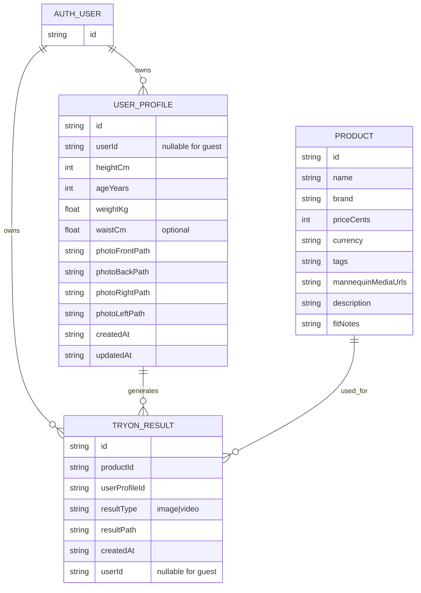

## 1. Architecture Design
MVP uses Next.js (App Router) with Supabase for database + storage. Try-on generation is abstracted behind a single server endpoint so the “generator” can start as a simulator and later be replaced by a real AI provider without changing the UI flows.



## 2. Technology Description
- Frontend/Backend: Next.js (App Router) + React + TypeScript
- Styling: tailwindcss@3 (custom theme tokens for matte black + emerald) + handcrafted CSS animations for scan effects
- Database/Auth/Storage: Supabase (Postgres + Supabase Auth + Supabase Storage)
- Supabase client: `@supabase/supabase-js` (browser client for auth + reads, server client for privileged operations)
- Deployment target (typical): Vercel (Next.js) + Supabase (managed)

## 3. Route Definitions
| Route | Purpose |
|-------|---------|
| /onboarding | Bio-metrics + 4-photo upload + scan mapping sequence |
| /catalog | Discovery grid of products on mannequin |
| /product/[id] | Product details + “Put You As A Model” try-on flow |
| /auth (optional) | Email OTP sign-in to sync profile + results |
| /history (optional) | Signed-in user’s past try-on results |

## 4. API Definitions (if backend exists)
Route Handlers (Next.js) provide a minimal API surface:

| Method | Route | Purpose |
|--------|-------|---------|
| POST | /api/profile | Create/update user profile + persist photo references |
| POST | /api/tryon | Create a try-on job and return generated media URL (simulated for MVP) |

Type definitions (conceptual):

```ts
export type UserProfileInput = {
  heightCm: number
  ageYears: number
  weightKg: number
  waistCm?: number
  photoPaths: {
    front: string
    back: string
    right: string
    left: string
  }
}

export type TryOnRequest = {
  productId: string
  userProfileId: string
  outputType: "image" | "video"
}

export type TryOnResponse = {
  tryOnResultId: string
  resultType: "image" | "video"
  resultUrl: string
}
```

## 5. Server Architecture Diagram (if backend exists)


## 6. Data Model (if applicable)

### 6.1 Data Model Definition
Core entities and relationships (Supabase Postgres):



### 6.2 Data Definition Language
SQL sketch (tables + helpful indexes). RLS policies should restrict `user_id` rows to the authenticated user; for guests, keep results session-scoped (e.g., stored locally) unless anonymous auth is enabled.

```sql
create table if not exists products (
  id uuid primary key default gen_random_uuid(),
  name text not null,
  brand text not null,
  price_cents int not null,
  currency text not null default 'USD',
  tags jsonb not null default '[]'::jsonb,
  mannequin_media_urls jsonb not null default '[]'::jsonb,
  description text not null default '',
  fit_notes text not null default '',
  created_at timestamptz not null default now()
);

create table if not exists user_profiles (
  id uuid primary key default gen_random_uuid(),
  user_id uuid references auth.users(id),
  height_cm int not null,
  age_years int not null,
  weight_kg numeric not null,
  waist_cm numeric,
  photo_front_path text not null,
  photo_back_path text not null,
  photo_right_path text not null,
  photo_left_path text not null,
  created_at timestamptz not null default now(),
  updated_at timestamptz not null default now()
);

create index if not exists user_profiles_user_id_idx on user_profiles(user_id);

create table if not exists tryon_results (
  id uuid primary key default gen_random_uuid(),
  user_id uuid references auth.users(id),
  user_profile_id uuid not null references user_profiles(id),
  product_id uuid not null references products(id),
  result_type text not null check (result_type in ('image','video')),
  result_path text not null,
  created_at timestamptz not null default now()
);

create index if not exists tryon_results_user_id_idx on tryon_results(user_id);
create index if not exists tryon_results_product_id_idx on tryon_results(product_id);
```
